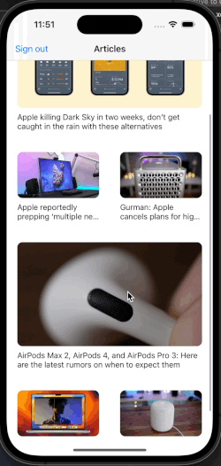
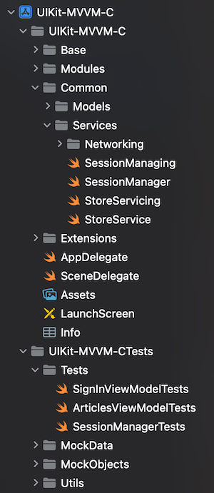

# UIKit-MVVM-C
A MVVM-C demo project that uses UIKit for UI, Combine for event handling, MVVM-C for software architecture and unit test.

This is a demo project that shows some techniques that I normally use in my projects. They are MVVM-C software architecture, Combine and unit test.

If you are using SwiftUI, this is SwiftUI version: https://github.com/huynguyencong/SwiftUI-MVVM-C

## Demo screen record

## Compatibility
- iOS 15 and later
- Swift 5 and later

## Project overview
The project uses a mock API to load a list of articles, show an article's details when users tap on it. You can also tap the sign in button to try sign in function.

The project uses MVVM-C (aka Model - View - ViewModel - Coordinator). Why is there Coordinator here? The Coordinator is an additional part for the MVVM, that help to separate navigation handling code to a different place, instead of putting it in the View (or View Controller in UIKit). It makes the view (or view controller in UIKit) more reusable, smaller.

## What you can find in this project
- MVVM-C implement with UIKit and Combine framework.
- Networking with Combine framework, written in the way that help to test it, and integrate other 3rd parties API easily.
- Unit test: Mock objects, mock data, dependency injection, etc. to test 
- Some useful extensions.
- Simple structure of a UIKit project.

## Project structure

## License
Copyright huynguyencong,  Licensed under the MIT license.
